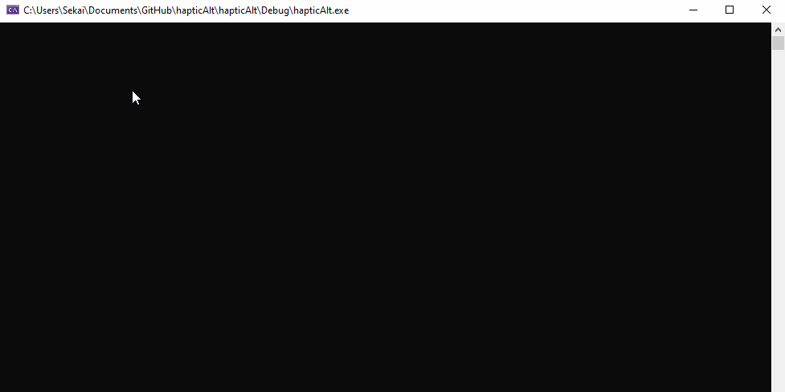

# About

hapticAlt acts as a dummy api for source code intended for the OpenHaptics platform / Phantom Omni haptic device.  This repo allows the user to define their own haptic rendering in the "hapticCallback()" function of hapticAlt.cpp.  The mouse position is tracked in the 2d plane of the screen (0,0 defined in top left corner, increasing right and down), and the velocity / acceleration are found through backwards differentiation (if used, some moving average or other filter can be implemented for smoothing).

This repo was intentionaly kept as simple as possible with no external libraries and as few source files as possible to avoid installation problems for users unfamiliar with C++.

The active plane can be swapped between XY, XZ, and ZY with the left and right arrow keys.  Pseudo haptic feedback applied to the mouse can be enabled / disabled with 'T'.

# Demo Functions

There are two demo functions: hapticCallbackDampingPlaneFieldDemo() and hapticCallbackSphereDemo().  These demo functions can be tested in place of the standard hapticCallback call.  To do so, change the "std::thread hapticRenderThread(hapticCallback);" call in main() to call one of the above demo functions.

The hapticCallbackDampingPlaneFieldDemo() is shown below.  Note the external forces (primarily in the y direction) are applied to the mouse when haptic feedback is enabled, pushing the mouse up on the screen in the beginning of the gif.  Note that the primary force in this example is the reaction force of a horizontal xz plane, so when we change the operating plane to XZ the HIP is pushed out of the plane in the y axis and no further forces are applied to the mouse even when haptic feedback is set to 1 (true).

